# 组件依赖层级分析

## 📊 层级统计

- **第 0 层（Endpoint 组件）**: 40 个（78.4%）
- **第 1 层**: 7 个（13.7%）
- **第 2 层**: 4 个（7.8%）
- **第 3 层**: 0 个

> **说明**: 层级表示组件距离基础组件（无依赖组件）的依赖深度。第 0 层组件不依赖任何其他内部组件，第 1 层组件依赖第 0 层组件，以此类推。

---

## 【第 0 层】Endpoint 组件（40个）

这些组件不依赖任何其他内部组件，是组件库的基础组件，可以直接使用。

| #   | 组件名                   | 说明                  |
| --- | ------------------------ | --------------------- |
| 1   | ActionWrapper            | 操作包装器            |
| 2   | CodeMirrorEditor         | CodeMirror 代码编辑器 |
| 3   | CodeMonacoEditor         | Monaco 代码编辑器     |
| 4   | ColorfulIcon             | 彩色图标              |
| 5   | ConfigEmptyProvider      | 配置空状态提供者      |
| 6   | Constant                 | 常量组件              |
| 7   | Detail                   | 详情组件              |
| 8   | DetailNav                | 详情导航              |
| 9   | DetailNavLayout          | 详情导航布局          |
| 10  | Empty                    | 空状态组件            |
| 11  | FormTable                | 表单表格              |
| 12  | Header                   | 头部组件              |
| 13  | IconText                 | 图标文本              |
| 14  | Input                    | 输入框                |
| 15  | InputNumber              | 数字输入框            |
| 16  | InputPassword            | 密码输入框            |
| 17  | ItemList                 | 项目列表              |
| 18  | Link                     | 链接组件              |
| 19  | NotFound                 | 404 页面              |
| 20  | PanicFallback            | 错误边界回退          |
| 21  | Progress                 | 进度条                |
| 22  | Radio                    | 单选框                |
| 23  | ResizableLayout          | 可调整大小布局        |
| 24  | ResourceName             | 资源名称              |
| 25  | ResponsiveDndCardsLayout | 响应式拖拽卡片布局    |
| 26  | Spin                     | 加载中                |
| 27  | Steps                    | 步骤条                |
| 28  | Switch                   | 开关                  |
| 29  | TagList                  | 标签列表              |
| 30  | TaskDot                  | 任务点                |
| 31  | Title                    | 标题                  |
| 32  | Upload                   | 上传组件              |
| 33  | WebTerminalConfirmModal  | Web 终端确认弹窗      |
| 34  | ZSVForm                  | ZSV 表单              |
| 35  | customRenderEmpty        | 自定义空状态渲染      |
| 36  | systemAlarmUuidList      | 系统告警 UUID 列表    |
| 37  | useMetricNameConfig      | 指标名称配置 Hook     |
| 38  | useShare                 | 分享 Hook             |
| 39  | useThirdPartyBuildName   | 第三方构建名称 Hook   |
| 40  | useThirdPartyConfig      | 第三方配置 Hook       |

---

## 【第 1 层】依赖第 0 层组件（7个）

这些组件直接依赖第 0 层的组件。

| #   | 组件名                    | 依赖的第 0 层组件                                            |
| --- | ------------------------- | ------------------------------------------------------------ |
| 1   | **IconState**             | ColorfulIcon                                                 |
| 2   | **List**                  | ResourceName                                                 |
| 3   | **MonitorSelect**         | ConfigEmptyProvider, Empty, customRenderEmpty                |
| 4   | **ResourceUsageProgress** | Progress                                                     |
| 5   | **SubAppLayout**          | ConfigEmptyProvider, Empty, PanicFallback, customRenderEmpty |
| 6   | **TextArea**              | Input                                                        |
| 7   | **useGetActiveMenuItem**  | ConfigEmptyProvider, Empty, PanicFallback, customRenderEmpty |

### 详细依赖关系

```
IconState
  └─→ ColorfulIcon (第 0 层)

List
  └─→ ResourceName (第 0 层)

MonitorSelect
  ├─→ ConfigEmptyProvider (第 0 层)
  ├─→ Empty (第 0 层)
  └─→ customRenderEmpty (第 0 层)

ResourceUsageProgress
  └─→ Progress (第 0 层)

SubAppLayout
  ├─→ ConfigEmptyProvider (第 0 层)
  ├─→ Empty (第 0 层)
  ├─→ PanicFallback (第 0 层)
  └─→ customRenderEmpty (第 0 层)

TextArea
  └─→ Input (第 0 层)

useGetActiveMenuItem
  ├─→ ConfigEmptyProvider (第 0 层)
  ├─→ Empty (第 0 层)
  ├─→ PanicFallback (第 0 层)
  └─→ customRenderEmpty (第 0 层)
```

---

## 【第 2 层】依赖第 1 层组件（4个）

这些组件依赖第 1 层的组件（可能同时依赖第 0 层组件）。

| #   | 组件名               | 依赖关系                                                                                                    |
| --- | -------------------- | ----------------------------------------------------------------------------------------------------------- |
| 1   | **InputDebounce**    | TextArea (第 1 层) → Input (第 0 层)                                                                        |
| 2   | **ModalTreeSelect**  | IconState (第 1 层) → ColorfulIcon (第 0 层)<br>ConfigEmptyProvider, Empty, customRenderEmpty (第 0 层)     |
| 3   | **PasswordDebounce** | TextArea (第 1 层) → Input (第 0 层)                                                                        |
| 4   | **TagAndAttribute**  | List (第 1 层) → ResourceName (第 0 层)<br>ConfigEmptyProvider, Empty, TagList, customRenderEmpty (第 0 层) |

### 详细依赖关系

```
InputDebounce
  └─→ TextArea (第 1 层)
      └─→ Input (第 0 层)

ModalTreeSelect
  ├─→ IconState (第 1 层)
  │   └─→ ColorfulIcon (第 0 层)
  ├─→ ConfigEmptyProvider (第 0 层)
  ├─→ Empty (第 0 层)
  └─→ customRenderEmpty (第 0 层)

PasswordDebounce
  └─→ TextArea (第 1 层)
      └─→ Input (第 0 层)

TagAndAttribute
  ├─→ List (第 1 层)
  │   └─→ ResourceName (第 0 层)
  ├─→ ConfigEmptyProvider (第 0 层)
  ├─→ Empty (第 0 层)
  ├─→ TagList (第 0 层)
  └─→ customRenderEmpty (第 0 层)
```

---

## 【第 3 层】依赖第 2 层组件

**当前无第 3 层组件**

---

## 📈 依赖层级可视化

```mermaid
graph TD
    %% 第 0 层（基础组件）
    subgraph L0["第 0 层 - 40 个组件"]
        Input[Input]
        ColorfulIcon[ColorfulIcon]
        ResourceName[ResourceName]
        Progress[Progress]
        ConfigEmptyProvider[ConfigEmptyProvider]
        Empty[Empty]
        PanicFallback[PanicFallback]
        customRenderEmpty[customRenderEmpty]
        TagList[TagList]
    end

    %% 第 1 层
    subgraph L1["第 1 层 - 7 个组件"]
        TextArea[TextArea]
        IconState[IconState]
        List[List]
        MonitorSelect[MonitorSelect]
        ResourceUsageProgress[ResourceUsageProgress]
        SubAppLayout[SubAppLayout]
        useGetActiveMenuItem[useGetActiveMenuItem]
    end

    %% 第 2 层
    subgraph L2["第 2 层 - 4 个组件"]
        InputDebounce[InputDebounce]
        PasswordDebounce[PasswordDebounce]
        ModalTreeSelect[ModalTreeSelect]
        TagAndAttribute[TagAndAttribute]
    end

    %% 依赖关系
    TextArea --> Input
    IconState --> ColorfulIcon
    List --> ResourceName
    ResourceUsageProgress --> Progress
    MonitorSelect --> ConfigEmptyProvider
    MonitorSelect --> Empty
    MonitorSelect --> customRenderEmpty
    SubAppLayout --> ConfigEmptyProvider
    SubAppLayout --> Empty
    SubAppLayout --> PanicFallback
    SubAppLayout --> customRenderEmpty
    useGetActiveMenuItem --> ConfigEmptyProvider
    useGetActiveMenuItem --> Empty
    useGetActiveMenuItem --> PanicFallback
    useGetActiveMenuItem --> customRenderEmpty

    InputDebounce --> TextArea
    PasswordDebounce --> TextArea
    ModalTreeSelect --> IconState
    ModalTreeSelect --> ConfigEmptyProvider
    ModalTreeSelect --> Empty
    ModalTreeSelect --> customRenderEmpty
    TagAndAttribute --> List
    TagAndAttribute --> ConfigEmptyProvider
    TagAndAttribute --> Empty
    TagAndAttribute --> TagList
    TagAndAttribute --> customRenderEmpty

    %% 样式
    classDef level0 fill:#90EE90,stroke:#333,stroke-width:2px
    classDef level1 fill:#FFE4B5,stroke:#333,stroke-width:2px
    classDef level2 fill:#FFB6C1,stroke:#333,stroke-width:2px

    class Input,ColorfulIcon,ResourceName,Progress,ConfigEmptyProvider,Empty,PanicFallback,customRenderEmpty,TagList level0
    class TextArea,IconState,List,MonitorSelect,ResourceUsageProgress,SubAppLayout,useGetActiveMenuItem level1
    class InputDebounce,PasswordDebounce,ModalTreeSelect,TagAndAttribute level2
```



---

## 🔍 关键发现

### 最长依赖链

1. **TagAndAttribute** → List → ResourceName（2 层）
2. **InputDebounce/PasswordDebounce** → TextArea → Input（2 层）
3. **ModalTreeSelect** → IconState → ColorfulIcon（2 层）

### 最常用的基础组件

以下第 0 层组件被多个组件依赖：

- **ConfigEmptyProvider**: 被 4 个组件依赖（MonitorSelect, SubAppLayout, useGetActiveMenuItem, TagAndAttribute）
- **Empty**: 被 4 个组件依赖（MonitorSelect, SubAppLayout, useGetActiveMenuItem, TagAndAttribute）
- **customRenderEmpty**: 被 4 个组件依赖（MonitorSelect, SubAppLayout, useGetActiveMenuItem, TagAndAttribute）
- **PanicFallback**: 被 2 个组件依赖（SubAppLayout, useGetActiveMenuItem）
- **Input**: 被 3 个组件依赖（TextArea, InputDebounce, PasswordDebounce）
- **TextArea**: 被 2 个组件依赖（InputDebounce, PasswordDebounce）
- **ColorfulIcon**: 被 2 个组件依赖（IconState, ModalTreeSelect）
- **ResourceName**: 被 2 个组件依赖（List, TagAndAttribute）
- **IconState**: 被 1 个组件依赖（ModalTreeSelect）
- **List**: 被 1 个组件依赖（TagAndAttribute）

### 依赖层级健康度

✅ **优秀**:

- 78.4% 的组件是基础组件（第 0 层）
- 最大依赖深度仅为 2 层
- 无循环依赖
- 依赖关系清晰，易于维护

---

## 📝 使用建议

1. **优先使用第 0 层组件**: 这些组件没有内部依赖，使用最简单
2. **注意依赖链**: 使用第 1、2 层组件时，确保其依赖的组件已正确导入
3. **避免深层依赖**: 当前最大深度为 2 层，这是健康的依赖结构
